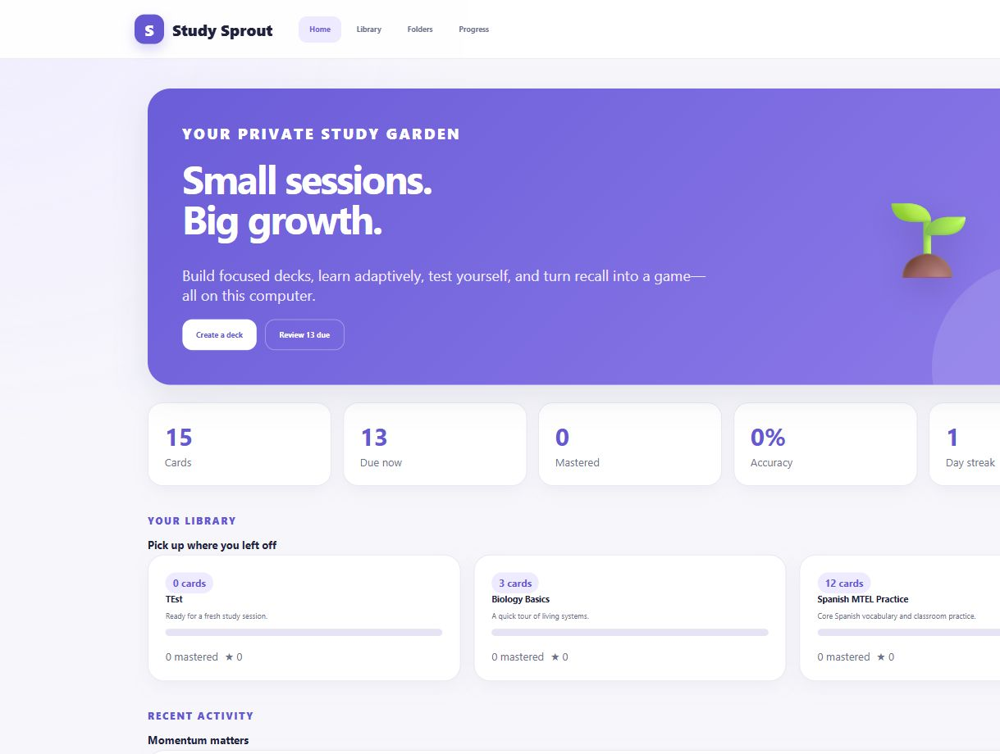

# Study Sprout

Study Sprout is a private, local-first flashcard and study application with a FastAPI website, SQLite storage, and a stdio MCP server for Codex. It is open source, binds only to `127.0.0.1`, uses no paid services, and sends no study data off the computer.

It is an original project inspired by familiar active-recall workflows. It is not affiliated with or endorsed by Quizlet.



## What it includes

- Deck and card CRUD with a simple autosaving Front/Back row editor, drag ordering, duplication, search, folders, printing, and persistent SQLite storage. Advanced card metadata such as tags, hints, alternate answers, explanations, stars, languages, and local images remains available through the REST API and MCP tools.
- Flashcards with animated flips, keyboard navigation, touch swipes, shuffle, autoplay, orientation switching, speech synthesis, stars, four review ratings, spaced repetition, and refresh resume.
- Learn with multiple-choice prompts only, adaptive ordering, configurable goals, answer direction, missed-card repetition, starred-only sessions, progress saving, and restart resume.
- Write with Don't know, immediate corrections, a dependable user grading override, and two-correct mastery.
- Spell with private browser speech synthesis, replay, slow audio, character-level spelling feedback, and two-correct mastery.
- Test with configurable size and question types, multiple-choice, generated true/false pairs, written questions, starred-only tests, final submission, scoring, answer review, restart, and printable results.
- Match with six pairs, a timer, one-second mistake penalties, restart, persistent personal bests, and no effect on mastery.
- Progress with Not Studied / Still Learning / Mastered groups, due dates, accuracy, streaks, study time, most-missed cards, test history, mode completions, activity history, and Match history.
- JSON, CSV, and tab/comma/dash-separated text import with preview and transactional validation, plus JSON/CSV/text export.
- Permanent deck combining, portable exports, folder study organization, mastery filters, and starred subsets.
- Forty-plus typed MCP tools covering lifecycle, decks, cards, folders, study sessions, tests, reviews, progress, activity, Match, imports, and exports.

## Windows quick start

Python 3.9 or newer is required.

```powershell
git clone https://github.com/resace3/mcp-local-study-app.git
cd mcp-local-study-app
powershell -ExecutionPolicy Bypass -File scripts/install.ps1
powershell -ExecutionPolicy Bypass -File scripts/start.ps1
```

`start.ps1` is idempotent, selects an available localhost port from `8080` through `8104`, waits for health, and opens the app. Use `-NoOpen` to start it without opening a browser.

```powershell
powershell -ExecutionPolicy Bypass -File scripts/start.ps1 -NoOpen
powershell -ExecutionPolicy Bypass -File scripts/stop.ps1
```

Study data lives in `%LOCALAPPDATA%\local-study-app` by default. Set `STUDY_DATA_DIR` before launching to use a different location. Versioned, idempotent migrations preserve existing decks and reviews.

## MCP registration

After installation, register the absolute virtual-environment interpreter path so the server works from any directory:

```powershell
codex mcp add local-study-app -- "C:\absolute\path\to\mcp-local-study-app\.venv\Scripts\python.exe" -m local_study_app.mcp_server
codex mcp list
```

Useful prompts include:

- “Open my Study Sprout website.”
- “Create a biology deck and add these terms.”
- “Start an adaptive Learn session from my starred Spanish cards.”
- “Show my most-missed cards and due reviews.”
- “Generate and score a six-question test.”
- “Export my deck as CSV.”

The MCP protocol uses newline-delimited JSON over stdio and never writes non-protocol messages to stdout. Every tool has a JSON input schema, description, structured result, and consistent `{success, data, summary, error}` envelope.

## Architecture

```text
Browser on 127.0.0.1
        |
FastAPI REST API ---- vanilla HTML/CSS/ES modules
        |
Shared Python service layer ---- stdio MCP server
        |
SQLite + application-scoped media/exports/logs
```

There is no Node.js production runtime, external model, cloud synchronization, account system, analytics SDK, or runtime CDN. Browser speech synthesis provides audio without uploading text.

## API and data safety

Interactive API documentation is available at `/api/docs` while the app is running. Mutations use typed request bodies and the same result envelope as MCP tools.

- SQL statements are parameterized.
- User text is escaped before HTML rendering.
- Uploads accept PNG, JPEG, WebP, or GIF only, with a 5 MB limit and generated filenames.
- Media and export routes resolve only application-owned filenames.
- Imports are limited to 2 MB, validated before commit, and rolled back on malformed input.
- Lifecycle state includes a random instance token and PID returned by the health endpoint, preventing stop commands from signaling an unrelated process.
- Logs rotate at 1 MB and contain no telemetry or study-card dumps.
- The MCP surface intentionally has no generic shell or arbitrary file-access tool.

## Verification

```powershell
powershell -ExecutionPolicy Bypass -File scripts/test.ps1
```

The suite covers migrations, CRUD, ordering, stars, folders, grading, adaptive sessions, resume state, quiz formats and scoring, spaced repetition, Match isolation, progress, import/export rollback, media validation, REST envelopes, MCP schemas/calls/errors, and lifecycle ownership. GitHub Actions runs Python 3.9, 3.11, and 3.12, a real Chromium responsive test at desktop/tablet/390-pixel widths, and a secret scan.

See [the detailed MCP test report](docs/MCP_TEST_REPORT.md) and [all screenshots](docs/screenshots/).

## Uninstall

```powershell
powershell -ExecutionPolicy Bypass -File scripts/uninstall.ps1
```

This stops Study Sprout and removes only the repository virtual environment. Study data is preserved by default. To explicitly remove the database, media, exports, and logs too:

```powershell
powershell -ExecutionPolicy Bypass -File scripts/uninstall.ps1 -PurgeData
```

The repository directory is never deleted by the script.

## License

MIT
